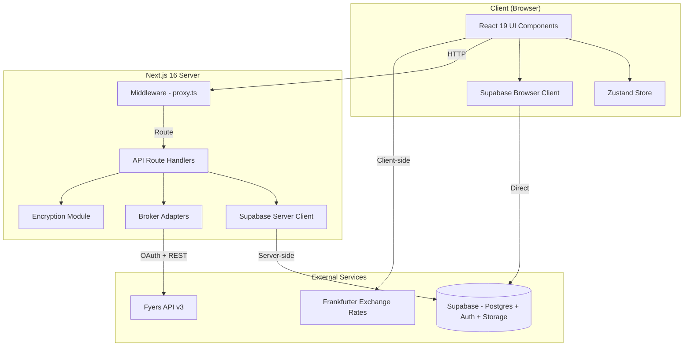
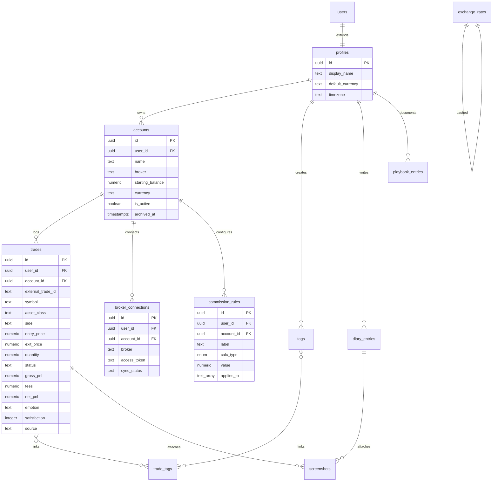
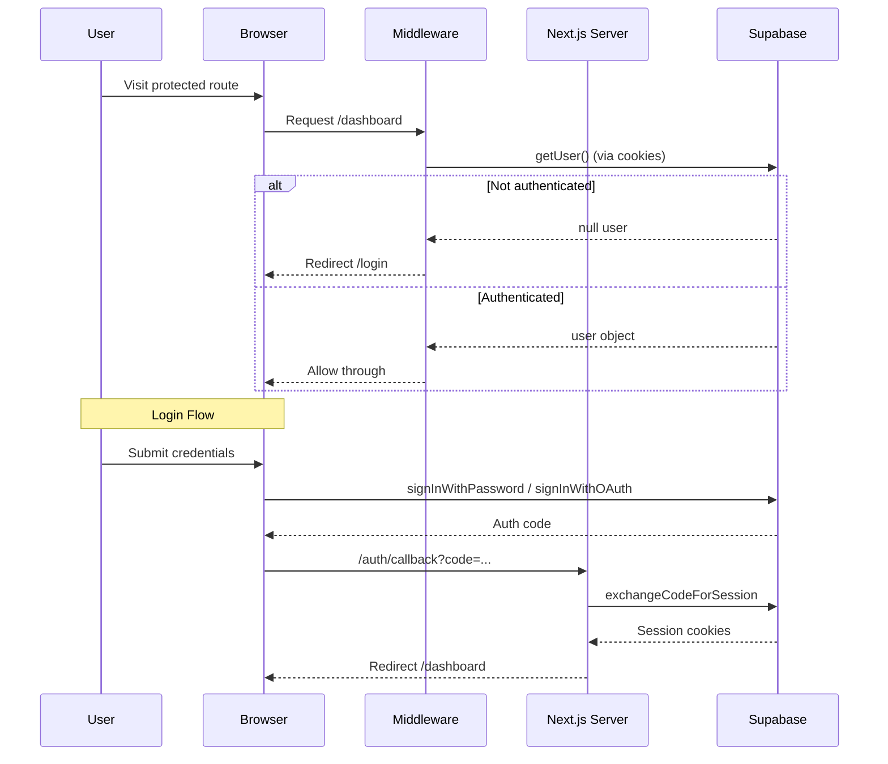
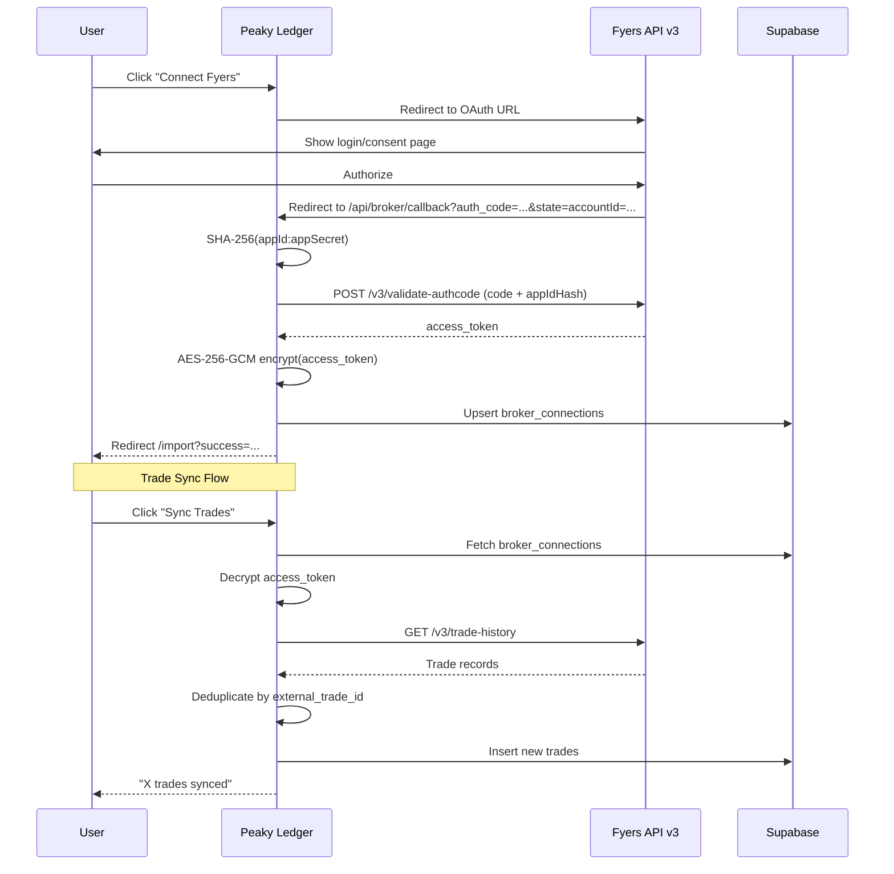
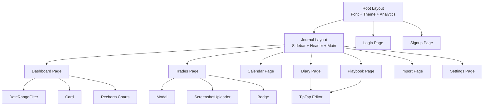

# Peaky Ledger — System Architecture & Design

This document details the system design, database schema, authentication flows, broker integration patterns, and key business logic implemented in **Peaky Ledger**.

---

## 1. High-Level Architecture



---

## 2. Directory Structure

```
peaky-ledger/
├── docs/
│   └── architecture.md            # ← THIS FILE
├── supabase/
│   └── schema.sql                 # PostgreSQL migrations, triggers & RLS policies
├── src/
│   ├── proxy.ts                   # Next.js middleware entry point
│   ├── app/                       # Next.js 16 App Router
│   │   ├── layout.tsx             # Root layout (font, theme, analytics)
│   │   ├── page.tsx               # Root redirect → /dashboard
│   │   ├── globals.css            # Complete design system & theme tokens
│   │   ├── (journal)/             # Protected route group (Sidebar + Header shell)
│   │   │   ├── layout.tsx         # Shell layout
│   │   │   ├── dashboard/         # Performance KPIs + charts
│   │   │   ├── trades/            # Trade CRUD + filters + tags + screenshots
│   │   │   ├── calendar/          # Monthly P&L calendar view
│   │   │   ├── diary/             # Mood tracker + rich text journal
│   │   │   ├── playbook/          # Strategy documentation
│   │   │   ├── import/            # CSV import + broker connect/sync
│   │   │   └── settings/          # Account + commission + profile management
│   │   ├── api/broker/            # Server-side broker API routes
│   │   │   ├── connect/           # OAuth redirect generation
│   │   │   ├── callback/          # OAuth code exchange + token storage
│   │   │   └── sync/              # Trade fetching + deduplication
│   │   ├── auth/callback/         # Supabase Auth session exchange
│   │   ├── oauth/consent/         # Google OAuth callback
│   │   ├── login/                 # Login page
│   │   └── signup/                # Signup page
│   ├── components/
│   │   ├── layout/                # Sidebar, Header, DateRangeFilter
│   │   └── ui/                    # Button, Card, Input, Select, Badge, Modal, ThemeToggle, ScreenshotUploader
│   ├── store/                     # Zustand state management
│   │   └── useJournalStore.ts
│   ├── types/                     # TypeScript interfaces
│   │   └── journal.ts
│   └── utils/
│       ├── broker/adapter.ts      # BrokerAdapter interface + FyersAdapter
│       ├── supabase/              # Client/Server/Middleware + centralized queries
│       ├── commission.ts          # Commission calculation engine
│       ├── currency.ts            # Exchange rate API + caching + formatting
│       ├── encryption.ts          # AES-256-GCM for broker tokens
│       ├── metrics.ts             # Trading metrics calculator
│       ├── screenshots.ts         # Supabase Storage operations
│       └── useCurrency.ts         # React currency conversion hook
```

---

## 3. Database Schema

### 3.1 Entity Relationship Diagram



### 3.2 Row Level Security (RLS)

All tables enforce RLS with the pattern:
```sql
CREATE POLICY "policy_name" ON public.table_name
  FOR ALL USING (auth.uid() = user_id);
```

Exception: `exchange_rates` allows public SELECT and authenticated INSERT.

### 3.3 Auto-Profile Trigger

A PostgreSQL trigger creates a `profiles` row automatically when a new user signs up via Supabase Auth:
```sql
CREATE OR REPLACE FUNCTION public.handle_new_user()
RETURNS TRIGGER AS $$
BEGIN
  INSERT INTO public.profiles (id, display_name)
  VALUES (new.id, COALESCE(
    new.raw_user_meta_data->>'full_name',
    new.raw_user_meta_data->>'display_name',
    split_part(new.email, '@', 1)
  ));
  RETURN NEW;
END;
$$ LANGUAGE plpgsql SECURITY DEFINER;
```

---

## 4. Authentication Architecture



---

## 5. Broker Integration Architecture

### 5.1 Adapter Pattern

```typescript
interface BrokerAdapter {
  getAuthUrl(accountId?: string): string
  exchangeCodeForToken(code: string): Promise<{ accessToken: string; expiry: Date }>
  fetchTrades(accessToken: string, appId: string, params: {
    fromDate: string; toDate: string; symbol?: string
  }): Promise<Partial<Trade>[]>
}
```

### 5.2 Fyers OAuth Flow



### 5.3 Token Security

Broker access tokens are encrypted at rest using AES-256-GCM:
- Algorithm: `aes-256-gcm`
- IV: 12 random bytes (96 bits)
- Key: 32 bytes from `BROKER_TOKEN_ENCRYPTION_KEY` environment variable
- Storage format: `iv_base64:authTag_base64:ciphertext_base64`

---

## 6. Data Flow Architecture

### 6.1 Trade P&L Calculation

```
entry_price, exit_price, quantity, side, contract_multiplier → grossPnL
  grossPnL = (exitPrice - entryPrice) × quantity × direction × multiplier
  direction = side === 'LONG' ? 1 : -1

commission_rules → fees
  fees = Σ(active rules matching asset class)

netPnL = grossPnL - fees
```

### 6.2 Metrics Calculation Pipeline

```
trades (filtered by date + account) → calculateMetrics()
  ├── winRate = (winners / total) × 100
  ├── profitFactor = totalWins / totalLosses
  ├── expectancy = (winRate × avgWin) - (lossRate × avgLoss)
  ├── equityCurve = chronological running balance
  └── dailyPnL = grouped by entry date
```

### 6.3 Currency Conversion Flow

```
User selects preferred currency (Header) → Zustand store
  │
  ├── useCurrency() hook loads rates from Frankfurter API
  │   ├── Check memory cache (12h TTL)
  │   ├── Check localStorage cache
  │   └── Fetch from api.frankfurter.dev/v1/latest
  │       └── Fallback to hardcoded rates
  │
  └── Dashboard/Trades pages convert amounts before display
      formatAmount(amount, fromCurrency) → converted & formatted string
```

---

## 7. Commission Engine

Stackable, per-account commission rules supporting three calculation types:

| Type | Formula |
|---|---|
| `percent_of_turnover` | `(value / 100) × (entryPrice + exitPrice) × quantity` |
| `flat_per_trade` | `value` per trade |
| `per_unit` | `value × quantity` |

Rules are:
- Filtered by `is_active` flag
- Filtered by `applies_to` array (asset classes) — empty array means "all"
- Applied additively (stackable)
- Auto-calculated on trade create/update (with manual override option)

---

## 8. Frontend Component Architecture



---

## 9. Styling Architecture

### Design Token System (HSL-based)

```css
/* Color composition pattern */
--h-primary: 226;    /* Hue */
--s-primary: 96%;    /* Saturation */
--l-primary: 60%;    /* Lightness */
--primary: hsl(var(--h-primary), var(--s-primary), var(--l-primary));
```

### Theme Layers (in priority order)

1. `:root` — default light mode values
2. `@media (prefers-color-scheme: dark)` — system preference override
3. `[data-theme='light']` / `[data-theme='dark']` — explicit user choice (highest priority)

### Theme Persistence

- Stored in `localStorage` key `peaky-theme`
- Applied via `data-theme` attribute on `<html>`
- Anti-FOUC inline script in root layout reads and applies before paint

---
