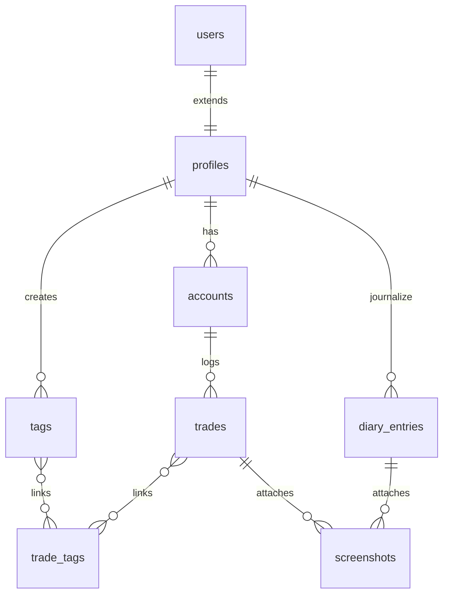

# Peaky Ledger — System Architecture & Design

This document details the system design, file structure, database relations, and key patterns implemented in **Peaky Ledger**.

---

## 1. Directory Structure

```
peaky-book/
├── docs/
│   └── architecture.md            # System architecture details
├── supabase/
│   └── schema.sql                 # PostgreSQL migrations, triggers & RLS
├── src/
│   ├── app/                       # Next.js 16 App Router
│   │   ├── (journal)/             # Protected routing group (Header/Sidebar shell)
│   │   │   ├── dashboard/         # Dashboard visual KPI and Recharts panels
│   │   │   ├── trades/            # Trade logs and CRUD modal inputs
│   │   │   ├── calendar/          # Monthly P&L roadmap
│   │   │   ├── diary/             # Mental mood & TipTap reflections editor
│   │   │   ├── playbook/          # Setup strategy pages
│   │   │   └── settings/          # Currency config & data backups
│   │   ├── api/                   # Server API Route Handlers
│   │   │   └── broker/            # Fyers connect/sync API handlers
│   │   ├── auth/                  # OAuth Callback handlers
│   │   ├── globals.css            # Responsive layout & custom style tokens
│   │   └── layout.tsx             # Theme injection script & global layout
│   ├── components/                # Modular client layout components
│   │   ├── layout/                # Persistent Sidebar and Header components
│   │   └── ui/                    # Reusable Button, Card, Modal, Input, Badge components
│   ├── store/                     # Zustand state management
│   ├── types/                     # Global TypeScript interfaces
│   └── utils/                     # Helper modules
│       ├── broker/                # Broker interface & Fyers v3 Adapters
│       └── supabase/              # Browser/Server Supabase client creators
```

---

## 2. Database Schema Relationships

Peaky Ledger leverages a relational schema to manage trading data efficiently, defined in [schema.sql](file:///Users/infierno/Dev/peaky-book/supabase/schema.sql):



### Core Relational Concepts:
* **Profiles**: Extends Supabase auth details automatically on user signup using a PostgreSQL trigger.
* **Accounts**: Supports multiple brokers (e.g. Fyers vs Manual mock accounts).
* **Trades**: Contains core transaction values, execution dates, setup definitions, and psychological parameters.
* **Tags**: Linked via `trade_tags` table for many-to-many custom classifications.

---

## 3. Broker Adapter Pattern

To ensure support for future exchanges and brokers, broker integrations conform to the `BrokerAdapter` interface defined in `src/utils/broker/adapter.ts`:

```typescript
export interface BrokerAdapter {
  getAuthUrl(): string
  exchangeCodeForToken(code: string): Promise<{ accessToken: string; expiry: Date }>
  fetchTrades(
    accessToken: string,
    appId: string,
    params: {
      fromDate: string
      toDate: string
      symbol?: string
    }
  ): Promise<Partial<Trade>[]>
}
```

### Fyers Implementation (`FyersAdapter`):
1. **OAuth Connection**: Generates standard authorization URLs using the `client_id` and registers redirects.
2. **Token Exchange**: Hashes `appId` and `appSecret` using SHA-256 to validate the auth code against Fyers API v3.
3. **Trade Fetching**: Queries the `/api/v3/trade-history` Reports endpoint to retrieve historical records, maps Fyers exchange segment indexes into standard currencies, asset classes, and quantities.

---

## 4. Row Level Security (RLS)

All tables strictly enforce RLS policies:
* **Select/Insert/Update/Delete** operations match `auth.uid() = user_id`.
* Prevents cross-tenant data leaks at the database level.
* Enables frontend client components to directly query Supabase tables safely.
